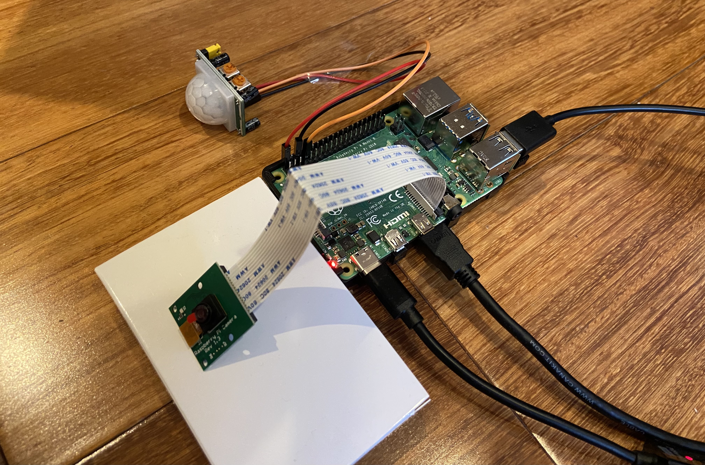

# IoT -- EE 629

## Final Project: Home Security Camera

###  The motivation for this project is to provide a security system powered by Python and Raspberry Pi.

### To complete this project, I have used Raspberry Pi 4, 5 Megapixels 1080p Sensor Mini Camera Module, PIR Sensor Infrared (IR) Body Motion Module, and 3 female-to-female jumper wires.

### For more information go to the Home Security Camera folder. 

## Credit

### The following contributions by [AO8](https://gist.github.com/AO8/29e04da9a0410fd672d1e29b65908808#file-motion_video_alert-py) and [others](http://raspi.tv/2013/another-way-to-convert-raspberry-pi-camera-h264-output-to-mp4):
Use Python, a PIR sensor, Raspberry Pi, and PiCamera to detect motion, record h264 video with timestamp, convert to mp4, then email video as an attachment from Gmail. 
